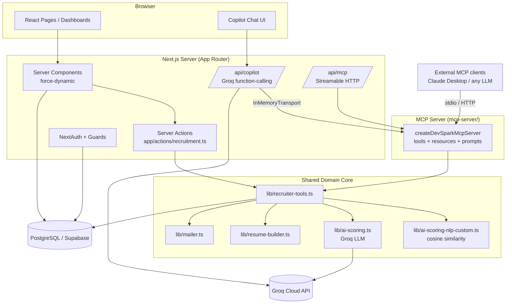
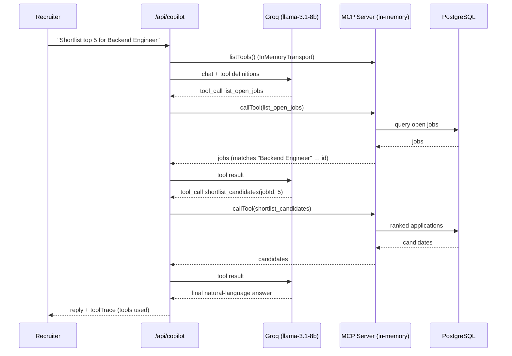
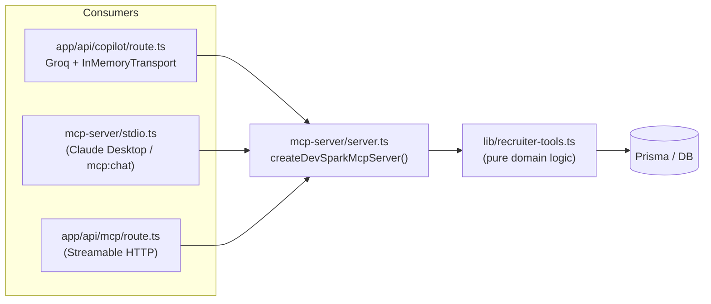

# DevSpark — Architecture & AI Features

**DevSpark** is an AI-assisted smart recruitment platform. Applicants build profiles and AI-generated resumes and apply to job circulars; the system scores each resume against the job requirements; recruiters and admins review, rank, shortlist, and schedule interviews — assisted by an **AI Recruiter Copilot** and a custom **Model Context Protocol (MCP)** server.

This document explains the overall architecture, the features in the project, and — in depth — the **AI features**.

---

## 1. Technology Stack

| Layer | Technology |
|---|---|
| Framework | Next.js 16 (App Router, Turbopack), React 19, TypeScript 5 |
| Styling | Tailwind CSS v4, lucide-react icons |
| Auth | NextAuth v4 (JWT sessions) — Credentials + optional Google OAuth |
| ORM / DB | Prisma 6 → PostgreSQL (Supabase) |
| LLM | Groq SDK — `llama-3.1-8b-instant` |
| Agent protocol | `@modelcontextprotocol/sdk` (MCP) — **server + client** |
| Email | Nodemailer (Gmail SMTP) |
| Validation | Zod v4 |

---

## 2. High-Level Architecture



### Request paths

- **Page render** — Server Components query Prisma directly (`export const dynamic = "force-dynamic"`), guarded by `requireAuth` / `requireRole`.
- **Mutations** — Server Actions in `app/actions/recruitment.ts` (apply, create/edit job, shortlist, schedule, manage users).
- **AI chat** — `POST /api/copilot` runs a Groq function-calling loop whose tools are the MCP server (linked in-process).
- **MCP over the wire** — `/api/mcp` (HTTP) and `mcp-server/stdio.ts` (stdio) expose the same server to external clients.

---

## 3. Roles & Access Control

Three roles (`Role` enum): `APPLICANT`, `RECRUITER`, `ADMIN`.

| Capability | Applicant | Recruiter | Admin |
|---|:---:|:---:|:---:|
| Build profile + AI resume, apply to jobs | ✅ | | |
| Overview, Job circulars (CRUD), Applications, **AI Copilot** | | ✅ | ✅ |
| Send invites / schedule interviews | | ✅ | ✅ |
| User management (roles, delete) | | | ✅ |

Enforced per-page and per-action via `lib/guards.ts` (`requireAuth`, `requireRole`). Session `id` + `role` are projected onto the JWT in `lib/auth.ts` and typed in `types/next-auth.d.ts`.

---

## 4. Data Model

```mermaid
erDiagram
    User ||--o| UserProfile : has
    User ||--o{ Application : submits
    User ||--o{ JobPosting : posts
    JobPosting ||--o{ Application : receives
    Application ||--o{ InterviewInvite : generates

    User { string id PK; string email; Role role; string passwordHash }
    UserProfile { string userId FK; string skills; string experience; string resumeDraft }
    JobPosting { string id PK; string title; string requirements; JobStatus status }
    Application { string id PK; float aiScore; string aiReasoning; ApplicationStatus status }
    InterviewInvite { string id PK; datetime scheduledStart; string meetingUrl; string mcpEventId }
```

- `Application` is unique per `(jobId, applicantId)` and stores the AI score + reasoning — **this persisted score acts as a cache** so candidates are never re-scored unless explicitly asked.
- `InterviewInvite` stores MCP scheduling output (`mcpEventId`, `mcpTrace`, `meetingUrl`).
- Status flow: `PENDING → SHORTLISTED → INVITED → INTERVIEW_SCHEDULED` (or `REJECTED`).

---

## 5. Features

### 5.1 Existing platform features
- Public marketing pages (home with live stats, about, careers, contact form via Server Action + Nodemailer).
- Public job board + job detail with apply form (paste / upload / use AI-built resume).
- Auth: email-password (bcrypt) + optional Google OAuth; sign-up endpoint.
- Applicant dashboard: profile editor (completion %), AI resume builder, applications + statuses.
- Admin dashboard: KPIs, top AI-scored applicants, job CRUD, application review, user management.
- Interview invites (email) + MCP-assisted interview scheduling.

### 5.2 Features added / fixed in this iteration

**New AI feature — the MCP layer (see §6, §7):**
- A complete **MCP server** exposing the recruitment domain as tools, resources, and prompts.
- An in-app **AI Recruiter Copilot** (chat) powered by Groq, driven through the MCP server.
- An in-app **MCP Console** (`/dashboard/admin/mcp`) — a web inspector that lists the live MCP tools and runs them in the browser, so the MCP server is demoable without a terminal.
- A standalone **Groq-powered MCP client** (`npm run mcp:chat`) — a terminal assistant usable without Claude.
- HTTP + stdio transports so the same server works for the app, Claude Desktop, or any MCP client.
- The interview-scheduling copilot runs in real **MCP mode** when `MCP_SERVER_URL` points at the project's own `/api/mcp`.

**Bug fixes / hardening:**
- Scoring made **frugal**: the zero-API cosine NLP scorer is the default for apply + seed; Groq reserved for the copilot / opt-in deep score. (Previously the seed wrote `undefined` scores due to an async/sync mismatch.)
- Restored the deleted `types/next-auth.d.ts` (production build was broken without it).
- Fixed the half-wired **RECRUITER** role (routed to the staff dashboard, broadened guards, created the recruiter account).
- Next 16 `searchParams` correctly awaited across 5 pages.
- AI score colour thresholds corrected to the 0–100 scale.
- Admin dashboard counts batched into a single `$transaction` (Supabase pgbouncer pool was being exhausted).
- Removed an unused dependency.

---

## 6. AI Features (in depth)

DevSpark has **four** distinct AI capabilities.

### 6.1 Resume ↔ Job scoring (two engines)

When an applicant applies (`applyToJobAction`), their resume text is scored against `job.requirements + job.description`. Two interchangeable engines share one signature, `scoreResumeAgainstRequirements(resume, requirements)`:

| Engine | File | Cost | When used |
|---|---|---|---|
| **NLP — cosine similarity** | `lib/ai-scoring-nlp-custom.ts` | Zero API (synchronous) | **Default** — apply flow, seed, shortlisting, job matching |
| **LLM — Groq** | `lib/ai-scoring.ts` | 1 Groq call | Opt-in (`useGroq` / "deep re-score") |

**NLP algorithm** (no external service):
1. Tokenize + remove stop words.
2. Build term-frequency vectors → **cosine similarity** between resume and requirements.
3. Extract the top requirement keywords → **keyword coverage** ratio.
4. Add a small structure bonus (resume has sections + sufficient length).
5. Weighted score (0–100): `semantic·0.58 + keywordCoverage·0.34 + structure·0.08`, plus matched/missing keyword lists and a reasoning sentence.

**Groq engine** prompts `llama-3.1-8b-instant` for strict JSON `{score, matchedKeywords, missingKeywords, reasoning}`, strips fences, clamps 0–100, and falls back gracefully on any error.

The result is stored on `Application.aiScore` / `aiReasoning` and drives ranking everywhere.

### 6.2 AI Recruiter Copilot (the headline feature)

A chat assistant for recruiters/admins (`/dashboard/admin/copilot`). It is a **genuine MCP client**: Groq is the reasoning engine, and every action is a real MCP tool call against the DevSpark MCP server, linked **in-process** via the SDK's `InMemoryTransport` (real protocol, no network hop, no Claude).



Implementation (`app/api/copilot/route.ts`): bounded loop (`MAX_ROUNDS = 4`), `temperature 0.2`, `max_tokens 700`, exposes a **7-tool subset** (calendar/email compat tools hidden from chat), returns the answer plus a `toolTrace` (shown as *"Tools used: …"*). It degrades gracefully on rate limits (429) and tool hallucinations.

### 6.3 Standalone Groq-powered MCP client ("Claude Desktop, replaced by Groq")

`mcp-server/groq-mcp-client.ts` (run with `npm run mcp:chat`) spawns the **stdio** MCP server as a child process, lists its tools, hands them to Groq, and runs the same tool-calling loop — dispatching through the real MCP protocol (`client.callTool`). This proves the MCP server is provider-agnostic and usable **without any Claude / Anthropic API key**.

### 6.4 Interview-scheduling copilot

`lib/interview-scheduling-copilot.ts` shortlists top-K candidates and schedules interviews. It runs in **`mcp` mode** when `MCP_SERVER_URL` is set (calling calendar/email MCP tools) and falls back to local generation + Nodemailer otherwise. Pointing `MCP_SERVER_URL` at the project's own `/api/mcp` closes the loop using the registered compat tools (`google_calendar_find_slots`, `google_calendar_create_event`, `gmail_send_email`).

### 6.5 AI resume builder

`lib/resume-builder.ts` deterministically renders a Markdown resume from the applicant's profile (with a templated "smart summary" when the summary is blank). Exposed both in the applicant dashboard and as the `build_resume` MCP tool.

---

## 7. MCP Architecture

The MCP layer follows one keystone rule: **a single shared, framework-free core** (`lib/recruiter-tools.ts`) holds all tool logic, and three different consumers reuse it. The core imports only Prisma + scorers + mailer (no `next/*`), with relative imports so it runs under `tsx` as well as Next.



### 7.1 MCP tools

| Tool | Purpose | Engine |
|---|---|---|
| `list_open_jobs` | Open postings + applicant counts | DB |
| `score_resume` | Score resume vs job/requirements | NLP (default) / Groq (opt-in) |
| `shortlist_candidates` | Top-K candidates for a job | DB + NLP |
| `find_matching_jobs` | Rank jobs for a candidate/resume | DB + NLP |
| `build_resume` | Markdown resume from a profile | Deterministic |
| `get_application_stats` | Platform / per-job hiring stats | DB |
| `schedule_interview` | Email invite + record slot | DB + Mailer |
| `google_calendar_find_slots` *(compat)* | Generate interview slots | Deterministic |
| `google_calendar_create_event` *(compat)* | Event id + meeting link | Deterministic |
| `gmail_send_email` *(compat)* | Send plain-text email | Mailer |

**Resources:** `jobs://open` (all open jobs), `job://{jobId}` (one posting).
**Prompts:** `screen_candidates` (shortlist + summarize), `draft_outreach` (invite message).

### 7.2 Transports

| Transport | File | Used by |
|---|---|---|
| **In-memory** | `InMemoryTransport` in `/api/copilot` | The in-app copilot (Groq) |
| **stdio** | `mcp-server/stdio.ts` | Claude Desktop, `npm run mcp:chat` |
| **Streamable HTTP** | `app/api/mcp/route.ts` (`WebStandardStreamableHTTPServerTransport`) | The app's own `lib/mcp-client.ts`, remote clients |

### 7.3 Frugal-Groq strategy (free-tier friendly)

| Path | Groq calls |
|---|---|
| Applicant applies / seed / shortlist / job match | **0** (NLP, zero API) |
| Copilot per user message | 1–3 (capped 4 rounds, 700 tokens) |
| `score_resume` / deep re-score | 0 unless `useGroq` opt-in |

Persisted `aiScore` is the cache; rate limits and tool hallucinations are caught and surfaced as friendly messages.

---

## 8. Key Files

```
app/
  actions/recruitment.ts           Server Actions (apply, jobs, shortlist, schedule, users)
  api/copilot/route.ts             AI Recruiter Copilot (Groq + in-memory MCP)   ★ new
  api/mcp/route.ts                 MCP over Streamable HTTP                        ★ new
  api/mcp-console/route.ts         MCP Console backend (list/call tools)          ★ new
  dashboard/admin/copilot/         Copilot chat page + client component           ★ new
  dashboard/admin/mcp/             MCP Console page + client component            ★ new
lib/
  recruiter-tools.ts               Shared MCP/domain tool core                     ★ new
  ai-scoring-nlp-custom.ts         Cosine-similarity scorer (default, zero API)
  ai-scoring.ts                    Groq LLM scorer (opt-in)
  resume-builder.ts                Deterministic resume generator
  interview-scheduling-copilot.ts  MCP/fallback interview scheduling
  mcp-client.ts                    Generic MCP client (HTTP/SSE)
  mailer.ts                        Nodemailer (invite + raw email)
  auth.ts / guards.ts              NextAuth config + role guards
mcp-server/
  server.ts                        createDevSparkMcpServer (tools/resources/prompts) ★ new
  stdio.ts                         stdio entry (Claude Desktop)                       ★ new
  groq-mcp-client.ts               Standalone Groq-powered MCP terminal client        ★ new
prisma/
  schema.postgres.prisma           Data model
  seed.ts                          Seed users + jobs + applications
```

---

## 9. Running & Demo

```bash
npm install
npx prisma generate
npm run dev          # http://localhost:3000

# Logins (seeded):
#   admin@devspark.com     / Admin@123
#   recruiter@devspark.com / Recruit@123
#   applicant@example.com  / Applicant@123

npm run mcp:chat                          # Groq + MCP in the terminal
npm run mcp:chat -- "show hiring stats"   # one-shot
npm run mcp:stdio                         # raw MCP server (Claude Desktop / any MCP client)
```

**Demo the copilot:** Dashboard → **AI Copilot** → e.g. *"List the open jobs, then shortlist the top 3 for the Backend Engineer role."*

**Enable real MCP-mode interview scheduling:** set `MCP_SERVER_URL="http://localhost:3000/api/mcp"` in `.env`.

### Claude Desktop config (optional)

```json
{
  "mcpServers": {
    "devspark-recruiter": {
      "command": "npx",
      "args": ["-y", "tsx", "/absolute/path/to/project1/mcp-server/stdio.ts"],
      "env": { "DATABASE_URL": "<your-database-url>", "GROQ_API_KEY": "<your-groq-key>" }
    }
  }
}
```

---

## 10. Design Highlights (for evaluation)

- **Custom MCP server** — the project does not just consume MCP, it *exposes* the recruitment domain as a reusable agent tool surface.
- **Provider-agnostic AI** — the same MCP tools are driven by Groq (free) in-app, by the terminal client, or by Claude Desktop. No vendor lock-in.
- **One shared core, three transports** — DRY tool logic reused across in-memory, stdio, and HTTP without duplication.
- **Cost-aware AI** — zero-API NLP scoring on the hot paths; the LLM is used only where it adds conversational value, keeping the project inside a free Groq tier.
- **Graceful degradation** — rate limits, tool hallucinations, and missing MCP/email config all fall back instead of crashing.
